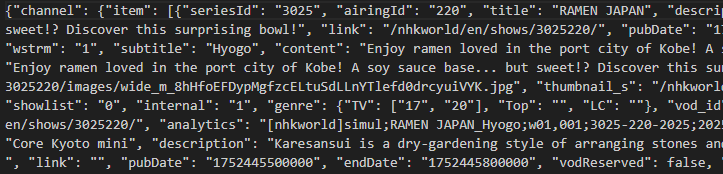
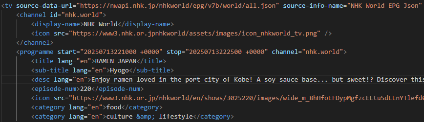

# NHK EPG to XMLTV converter

## From



## To


  
## The applications

- __`CreateNHKXMLTV.py`__

    Extracts NHK's EPG in JSON from its website  
    Converts it to an XMLTV file  
    Saves the XMLTV to a text file: `ConvertedNHK.xml`  
  
    A python 3.x and a separate python 2.7 versions are available  
  
- __`scrape_nhk_genres.py`__  

    NHK genres scraping application identify the genres NHK defined.  
    Saves the genres to a text file: `genres.txt`  
    This can be copied and pasted over (but currently isn't) into `CreateNHKXMLTV.py`  
  
    A python 3.x only version is available

- __RELEASE 1.5__

  - Windows 11 x64  

    Both applications are available through [Releases](https://github.com/Squizzy/NHK-World-XML-to-XMLTV/releases/tag/v1.5)  
    `CreateNHKXMLTV.exe` is all that's needed here.
    1. Download into a folder
    2. Ideally, for security, Virus check the file(s) + check the hash
  
        Instructions for Windows 11 Powershell build-in hash check:  
        For the legitimate expected hash values, run:  

        ```shell
        Get-FileHash -Path .\CreateNHKXMLTV.exe" -Algorithm SHA25
        ```

        Hash value: `FC9718E9B01CC5DC13B5A6EC8DBBE105C2E5C6D0093424230B80EC55CBF01C4C`  

        ```shell
        Get-FileHash -Path .\scrape_nhk_genres.exe" -Algorithm SHA25
        ```

        Hash value: `7F93C6F9462DC6BE15A8B8C58F770463881BA8C6BF9E53D9257BD526F1032523`  

    3. run `CreateNHKXMLTV.exe` 
    From the command line or Windows Explorer  
    The XMLTV is saved in the file `ConvertedNHK.xml` in the same folder.

## How to run the application which converts the EPG to XMLTV: `CreateNHKXMLTV`

### Python3

Currently hosted only in the __master__ branch of this github repository.  
Two files are needed: CreateNHKXMLTV.py and requirements.txt.

1. In a terminal, create a dedicated folder

    Open a console:

    > Windows, run Command Prompt (cmd.exe) or Powershell (powershell.exe)  
    > MacOS: run Terminal (Terminal.app)  
    > Linux: run Terminal (Terminal)

    Navigate to your preferred location then create the folder, e.g.:

    ```shell
    mkdir NHK-World-EPG-XMLTV-Extractor
    ```  

    ```shell
    cd NHK-World-EPG-XMLTV-Extractor
    ```

2. Download the required files from the repository

    - Either direct from here (place the files in the folder created earlier):
    > [CreateNHKXMLTV.py](https://github.com/Squizzy/NHK-World-XML-to-XMLTV/blob/master/Python/CreateNHKXMLTV.py)  
    > [requirements.txt](https://github.com/Squizzy/NHK-World-XML-to-XMLTV/blob/master/Python/requirements.txt)

    - or from the terminal:  

    ```shell
    curl -O https://github.com/Squizzy/NHK-World-XML-to-XMLTV/blob/master/Python/CreateNHKXMLTV.py
    ```

    ```shell
    curl -O https://github.com/Squizzy/NHK-World-XML-to-XMLTV/blob/master/Python/requirements.txt
    ```

3. Set up the environment:

    1. From the terminal in the folder created earlier, create a virtual environment in the folder (so all needed modules are isolated locally):

        ```shell
        python3 -m venv venv
        ```

    2. Load the environment:

        - For Windows:

        ```shell
        .\venv\Scripts\activate
        ```

        - For MacOS, Linux:

        ```shell
        source venv/bin/activate
        ```

    3. Load the required modules (Windows, MacOs, Linux):

        ```shell
        pip install -r requirements.txt
        ```

    This is now ready to run.

4. Launch

    ```shell
    python CreateNHKXMLTV.py
    ```

5. The XMLTV is saved in the file `ConvertedNHK.xml`.

### Python2

the __p2__ branch of this repository contains the python v2 version, as per external contributor dazzhk recommendation.  
it is not merged into master yet as it is not tested.
The same procedure as above.
  
However different files are currently needed

1. Same as above.

2. Download the required files from there repository (Section 2. of Python3 abobe):

    - Either direct from here (place the files in the folder created earlier):

    > [CreateNHKXMLTV.py](https://github.com/Squizzy/NHK-World-XML-to-XMLTV/blob/p2/Python/CreateNHKXMLTV.py)  
    > [requirements.txt](https://github.com/Squizzy/NHK-World-XML-to-XMLTV/blob/p2/Python/requirements.txt)

    - or from the terminal:  

    ```shell
    curl -O https://github.com/Squizzy/NHK-World-XML-to-XMLTV/blob/p2/Python/CreateNHKXMLTV.py
    ```

    ```shell
    curl -O https://github.com/Squizzy/NHK-World-XML-to-XMLTV/blob/p2/Python/requirements.txt
    ```

3. Set up the environment.

    1. the virtual environment must be for python2

        >Note: the first `venv` below represent the application executed to create the virtual environment and the second the name of the folder it is created in. If trying to compile with python 3 and python 2.7, the second `venv` could be called venv2.7 for example. This folder name would need to be used in step 2 of this section.

        ```shell
        python2 -m venv venv
        ```

    2. same as above

    3. same as above

4. Same as above.

5. Same as above.

## How to run the application which recovers the genres NHK support

### NHK genres scraper: `scrape_nhk_genres.py`

Downloads the list of genres from the NHK World website (different URL from EPG)
attempts to extract genres as NHK defines them.
Saves the result into a text file, `genres.txt`.
The content of this text file can be copied and pasted into the create `CreateNHKXMLTV.py` file before it is run so the latest genres can be applied.

### Requirements

- Python 3.x. (python v2 not yet available)
- its modules dependencies are included in the requirements.txt file so no need to re-run it.

### Launch

```shell
python3 scrape_nhk_genres.py
```

Runs on Windows, MacOS, Linux.  

## Background info

NHK World is a Japanese television channel that broadcasts a wide range of programming, including news, sports, and entertainment.
This is information that was collected from different sources.

## Note

All other files in this repository have no value and are only here mostly for historical reason (until they are removed)

## Version history

### CreateNHKXMLTV.py

20250715 - v1.5
    - Error checking on NHK URL access added for feedback
    - Progress feedback of application execution
    - Changed to GPLv2 license

20250715 - v1.4
    - Merged refactored Python3 version of CreateNHKXMLTV.py into master branch.
    - Corrected requirement.txt -> requirements.txt .

20240502 - v1.3
    - Version change to represent the refactored Python3 version of CreateNHKXMLTV.py in its devel branch.

20240415 - v1.2
    - Updated the URL for the NHK world EPG JSON as per external contributor fxbx recommendation
    - Replaced deprecated utcfromtimestamp(), added timeOffsetVariable
    - Cleaned up XML tree generation
    - Added some new genres

20190120 - v1.1
    - Changed to pulling the file from URL
    - Windows executable created using "auto-py-to-exe.exe .\CreateNHKXMLTV.py" (auto-pi-to-exe v2.5.1)\
      File to be found under "output" folder. Not virus checked.

20190119 - v1.0.5
    - Added second category (genre) for channels which have it

20190119 - v1.0.4
    - Corrected \<category\> (genre) to use all lowercase

20190119 - v1.0.3
    - Corrected \<Icon\> typo source xml

20190119 - v1.0.2
    - Added header, version, licence, and reference URL for later

19 Jan 2019 - v1.0.1
    - Some tidying up

20190119 - v1.0
    - First release as working version

### scrape_nhk_genres.py

20250715 - v1.2
    - Error checking on NHK URL access added for feedback
    - Refactored for clarity
    - Changed to GPLv2

20250715 - v1.1
    - Merged from development branch into master branch.

20240921 - v1.0
    - First release as a working version
